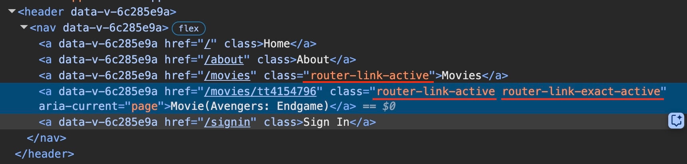

[vuejs]: readme.md
[][vuejs]

### INDEX

<table>
  <tr>
    <td><a href="sect_01.md"> [설치]        </a></td>
    <td><a href="sect_02.md"> [레이아웃]    </a></td>
    <td><a href="sect_03.md"> [스크롤]      </a></td>
    <td><b href="sect_04.md"> [탐색]        </b></td>
    <td><a href="sect_05.md"> [동적경로]    </a></td>
    <td><a href="sect_06.md"> [중첩경로]     </a></td>
    <td><a href="sect_07.md"> [없는페이지]    </a></td>  
    <td><a href="sect_08.md"> [내비게이션]   </a></td>  
    <td><a href="sect_09.md"> [페이지전환]   </a></td>  
    <td><a href="sect_10.md"> [배포]        </a></td>  
  </tr>
</table>

---
# 4. 탐색
- [컴포넌트 방식](#컴포넌트-방식) 
- [프로그래밍 방식](#프로그래밍-방식) 

---
### 컴포넌트 방식

앞서 작성한 헤더의 <a> 요소 탐색은 항상 페이지 전체를 로드합니다.<br/>
대신에 <RouterLink> 컴포넌트를 사용하면 탐색 시 필요한 부분만 업데이트하여 더 나은 사용자 경험을 제공할 수 있습니다.<br/>
<br/>
<RouterLink> 컴포넌트는 href 대신 to 속성에 이동할 경로를 지정합니다.<br/>
그리고 to 속성에 지정된 경로와 현재 경로의 일치 여부에 따라서 활성 클래스(router-link-active, router-link-exact-active)가 자동으로 추가됩니다.<br/>
활성 클래스에 맞게 내비게이션의 스타일을 추가하면, 사용자가 현재 페이지를 더 명확하게 파악할 수 있습니다.<br/>
<br/>

<pre>
ⓘ <RouterLink> 컴포넌트는 최종적으로 <a> 요소로 렌더링됩니다.
</pre>

다음과 같이 <TheHeader> 컴포넌트를 수정합니다.<br/>
`[/src/components/TheHeader.vue]`
```vue
<script setup lang="ts">
import { RouterLink } from 'vue-router'
</script>

<template>
  <header>
    <nav>
      <RouterLink to="/">Home</RouterLink>
      <RouterLink to="/about">About</RouterLink>
    </nav>
  </header>
</template>

<style scoped>
nav {
  display: flex;
  gap: 10px;
}
.router-link-exact-active {
  font-weight: bold;
  color: red;
}
</style>
```
<br/>

router-link-active 클래스는 지정된 경로가 현재 경로의 일부인 경우에 추가되며, router-link-exact-active 클래스는 지정된 경로와 현재 경로가 완전히 일치하는 경우에만 추가됩니다.<br/>

`활성 클래스` <br>

<br/>

<table>
    <thead>
        <tr>
            <th>지정 경로(<code>to</code>)</th>
            <th>현재 경로(URL)</th>
            <th><code>router-link-active</code></th>
            <th><code>router-link-exact-active</code></th>
        </tr>
    </thead>
    <tbody>
        <tr>
            <td><code>/</code></td>
            <td><code>/</code></td>
            <td>✅</td>
            <td>✅</td>
        </tr>
        <tr>
            <td><code>/</code></td>
            <td><code>/about</code></td>
            <td>❌</td>
            <td>❌</td>
        </tr>
        <tr>
            <td><code>/about</code></td>
            <td><code>/about</code></td>
            <td>✅</td>
            <td>✅</td>
        </tr>
        <tr>
            <td><code>/movies</code></td>
            <td><code>/movies</code></td>
            <td>✅</td>
            <td>✅</td>
        </tr>
        <tr>
            <td><code>/movies</code></td>
            <td><code>/movies/abc123</code></td>
            <td>✅</td>
            <td>❌</td>
        </tr>
        <tr>
            <td><code>/movies/abc123</code></td>
            <td><code>/movies/abc123</code></td>
            <td>✅</td>
            <td>✅</td>
        </tr>
    </tbody>
</table>
<br/>

`to` 속성에는 기본적으로 경로 전체를 문자로 작성합니다.<br/>
또는 필수적인 기본 경로(`path`)와 함께 쿼리스트링(`query`), 해시 프래그먼트(`hash`)를 선택적으로 포함하는 객체로 전달할 수 있습니다.<br/>
또는 필수적인 라우트 이름(`name`)과 함께 동적 파라미터(`params`), 쿼리스트링, 해시를 선택적으로 포함하는 객체로 전달할 수도 있습니다.<br/>

```vue
<template>
  <RouterLink :to="`/movies/${movieId}?plot=full#title`">
    페이지 이동
  </RouterLink>
  
  <RouterLink
    :to="{
      path: `/movies/${movieId}`,
      query: { plot: 'full' },
      hash: '#title'
    }">
    페이지 이동
  </RouterLink>
  
  <RouterLink
    :to="{
      name: 'MovieDetails',
      params: { movieId },
      query: { plot: 'full' },
      hash: '#title'
    }">
    페이지 이동
  </RouterLink>
</template>
```
<br/>

라우트 이름은 라우트 객체의 name 속성에 선택적으로 작성하며, 고유해야 합니다.<br/>
라우트를 이름으로 관리하면 경로가 변경되더라도 코드 수정이 최소화되고, 잘못된 경로를 실수로 작성하는 것을 방지할 수 있습니다.

```ts
// ...

const router = createRouter({
  // ...
  routes: [
    {
      name: 'Home',
      path: '/',
      component: HomePage
    },
    {
      name: 'About',
      path: '/about',
      component: AboutPage
    },
    {
      name: 'SignIn',
      path: '/signin',
      component: SignInPage
    },
    {
      name: 'Movies',
      path: '/movies',
      component: MoviesPage
      children: [
        {
          name: 'MovieDetails',
          path: ':movieId',
          component: MovieDetailsPage
        }
      ]
    },
    {
      name: 'NotFound',
      path: '/:pathMatch(.*)*',
      component: NotFoundPage
    }
  ]
})

export default router
```
<br/>

[[TOP]](#index)

---
### 프로그래밍 방식

`<RouterLink>` 컴포넌트를 사용하는 대신, 프로그래밍 방식으로도 탐색을 구현할 수 있습니다.<br/>
`useRouter()` 훅을 호출하면, 페이지 이동을 처리하는 여러 메서드를 가진 라우터 인스턴스를 얻을 수 있습니다.<br/>

- `push` : 새로운 페이지로 이동
- `replace` : 현재 페이지를 대체하고 새로운 페이지로 이동
- `back` : 뒤로가기
- `forward` : 앞으로가기
- `go` : 지정된 숫자만큼 뒤로 혹은 앞으로 이동

```vue
<script setup lang="ts">
import { useRouter } from 'vue-router'

const router = useRouter()
</script>

<template>
  <button @click="router.push('/')">페이지 이동</button>
  <button @click="router.replace('/about')">페이지 이동(뒤로가기 불가)</button>
  <button @click="router.back()">뒤로가기</button>
  <button @click="router.forward()">앞으로가기</button>
  <button @click="router.go(-1)">뒤로가기</button>
  <button @click="router.go(1)">앞으로가기</button>
</template>
```
<br/>

앞서 살펴본 `<RouterLink>` 컴포넌트의 `to` 속성과 마찬가지로, `push`와 `replace` 메서드에서도 경로를 문자 혹은 객체로 전달할 수 있습니다.<br/>
<br/>

```ts
function onlyString(movieId: string) {
  router.push(`/movies/${movieId}?plot=full#title`)
}

function pathObject(movieId: string) {
  router.push({
    path: `/movies/${movieId}`,
    query: { plot: 'full' },
    hash: '#title'
  })
}

function nameObject(movieId: string) {
  router.push({
    name: 'MovieDetails',
    params: { movieId },
    query: { plot: 'full' },
    hash: '#title'
  })
}
```
<br/>

[[TOP]](#index)

---